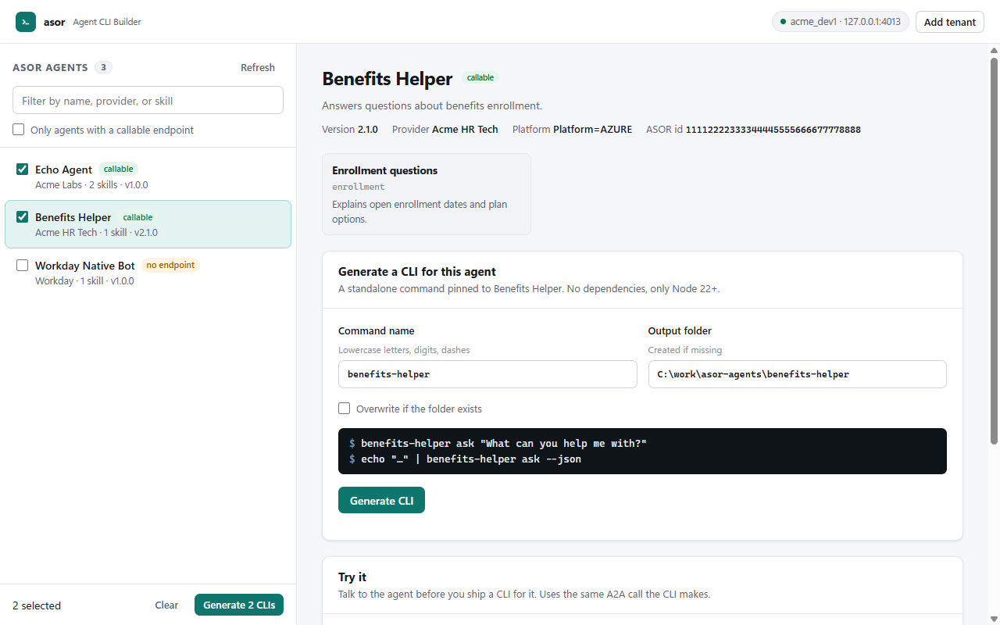

# asor-cli

**Turn each Workday ASOR agent into its own command-line tool.**

`asor` connects to a Workday tenant and lists the agents registered in its **Agent System of Record (ASOR)**. You pick the ones you want, and it **generates a dedicated CLI for each agent**:

- `benefits-helper ask "…"`
- `payroll-agent ask "…"`

Each CLI is pinned to one agent, has no dependencies, and ships with a Claude `SKILL.md` and an LLM `tool.json`. Hand it to a Slack bot, a Teams bot, Claude Code, a cron job, or anything else that can run a command. That surface never has to know about Workday, ASOR, or A2A.

```text
  asor ui  (or asor wrap)                          your surfaces
 ┌───────────────────────────┐   generates   ┌──────────────────────────────┐
 │ Workday tenant · ASOR     │ ────────────▶ │ benefits-helper   (its own   │──▶ Slack bot
 │  ☑ Benefits Helper        │               │ payroll-agent      CLI, skill│──▶ Teams bot
 │  ☑ Payroll Agent          │               │ …                  & tool)   │──▶ Claude Code
 │  ☐ Expenses Agent         │               └──────────────────────────────┘──▶ cron / CI / …
 └───────────────────────────┘
        each generated CLI talks to its one agent over A2A at runtime
```

> **Status: early (0.2).** The full test suite runs against the bundled mock tenant. The ASOR endpoints and headers come from Workday's published [ASOR API spec (v1.2)](https://github.com/Workday/asor) and from working registration code. Please [open an issue](https://github.com/gilfila/asor-cli/issues) with what you see on a real tenant.
>
> This is an independent open-source project. It is **not affiliated with or endorsed by Workday**.

## Install

```bash
npm install -g github:gilfila/asor-cli    # needs Node.js 22+
```

To install from a clone instead, run `npm install && npm run build && npm link`.

## Quickstart: pick agents, get CLIs

```bash
asor ui
```



This opens a local page in your browser, where you:

1. **Connect your tenant.** The simplest route is `asor login --authorize` first (browser sign-in, see [Tenant setup](#tenant-setup)); the page then picks up that profile. You can also paste a client id, secret, and refresh token into the page's connect form. Either way, credentials are saved to a local profile that only you can read, and verified against Workday.
2. **Browse the agents registered in ASOR.** Filter by name, provider, or skill. Agents marked *callable* expose an A2A endpoint.
3. **Try an agent** in the built-in chat before committing to it.
4. **Generate its CLI.** Choose the command name and the folder, or tick several agents and generate them all at once.
5. **Copy the recipe for your surface.** The recipes cover install, scripts, credentials, Slack, Teams, Claude Code, and LLM tools. You can also download the CLI as a `.zip` to move it to another machine.

Prefer the terminal? You get the same result without a browser:

```bash
asor login --authorize              # sign in to Workday in the browser (or: asor login to paste a refresh token)
asor wrap                           # lists the agents; pick e.g. "1,3" or "all"
asor wrap benefits-helper           # or name one directly → ./asor-agents/benefits-helper
```

You can try all of this without a tenant using the bundled mock tenant: run `npm run mock` in a clone, export the variables it prints, then run `asor ui`.

## What a generated CLI looks like

```text
asor-agents/benefits-helper/
  bin/benefits-helper.js   the CLI, pinned to this one agent (no dependencies; Node 22+)
  lib/                     the runtime it needs, vendored
  SKILL.md                 drop-in skill for Claude Code and other agents
  tool.json                function-calling tool definition (JSON Schema input + how to invoke)
  README.md                install + usage for whoever you hand it to
  agent-card.json          the ASOR definition it was generated from
```

```bash
npm install -g ./asor-agents/benefits-helper
benefits-helper ask "When does open enrollment start?"
echo "When does open enrollment start?" | benefits-helper ask --json     # for bots
benefits-helper ask --context-id <id> "and for dependents?"             # follow-up
benefits-helper info       # the agent's live ASOR definition
benefits-helper skills     # works offline
```

At runtime, the CLI looks up its agent in ASOR by id (falling back to its name if the agent was re-registered) and calls it over A2A. It reads the same credentials as `asor`: either a saved profile, or `ASOR_TENANT`, `ASOR_CLIENT_ID`, `ASOR_CLIENT_SECRET`, and `ASOR_REFRESH_TOKEN` on a bot host. **No credentials are ever written into the generated package.**

### The bot contract

Every generated CLI and `asor invoke` follow the same contract.

`--json` prints one envelope, `{ok, agent, contextId, taskId, state, text, artifacts, error}`, and the exit code tells a bot what happened:

| Code | Meaning |
|---|---|
| 0 | OK. This includes `input-required`: check `state` and reply with `--context-id` and `--task-id`. |
| 1 | Unexpected error |
| 2 | Usage error or ambiguous agent name |
| 3 | Auth or config problem. Don't retry. |
| 4 | Agent not found, or not invocable |
| 5 | The agent's task failed, was rejected, or timed out |

`ask` options:

| Option | What it does |
|---|---|
| `--stream` | Streams the answer. With `--json` the output is JSON Lines, and the last line is the envelope. |
| `--skill <id>` | Targets one skill. |
| `--timeout <s>` | Sets the timeout. The default is 120 seconds. |
| `--agent-auth none\|workday\|bearer` | Chooses the credential sent to the agent's own endpoint (see Security). |

## Use a generated CLI on any surface

| Surface | How |
|---|---|
| **Slack** | [`examples/slack-bolt`](examples/slack-bolt): Bolt in Socket Mode. Set `ASOR_WRAPPED_BIN` to a generated CLI and the bot answers @mentions with that agent, in threads. |
| **Microsoft Teams** | [`examples/teams`](examples/teams): a Bot Framework bot. Set `ASOR_WRAPPED_BIN`. One Teams conversation maps to one A2A context. |
| **Claude Code / agents** | [`examples/claude-skill`](examples/claude-skill): copy the wrapped `SKILL.md` into `.claude/skills/`. |
| **Any LLM tool-calling bot** | Register `tool.json`, run `invocation.command` with the message on stdin, and return `text`. |
| **Scripts / cron / CI** | `echo "..." \| benefits-helper ask --json \| jq -r .text`. Use the exit code to decide what happens next. |
| **Node code** | `import { createContext, resolveAgent, a2aInvoker } from 'asor-cli'`. This skips the subprocess entirely. |

The bot examples share [`examples/shared/asor-runner.mjs`](examples/shared/asor-runner.mjs), a small, safe way to call the CLI from a bot. Run `node examples/shared/demo.mjs` to exercise it against the mock tenant.

## All commands

| Command | What it does |
|---|---|
| `asor ui [--out dir] [--port n]` | Opens the local agent picker. It listens on 127.0.0.1 only and needs the session token in the printed URL. |
| `asor wrap [<agent>] [--out dir] [--name cmd]` | Generates a CLI for one agent. With no `<agent>`, you pick from a list. The alias is `asor generate`. |
| `asor login --authorize [--profile p]` | Signs in to Workday in the browser (Authorization Code + PKCE), saves the refresh token, and verifies it. |
| `asor login [--profile p]` | Saves a pasted refresh token instead. `--from-env` imports the `ASOR_*` variables. |
| `asor whoami` | Shows the resolved config with secrets masked, then tests the token exchange and an ASOR call. The errors include fix-it hints. |
| `asor profiles` / `asor logout` | Lists or deletes saved profiles. |
| `asor agents list` / `get <agent>` | Lists the registered agents, or shows one definition with its skills. |
| `asor agents register --file card.json` | Registers or updates an agent. ASOR upserts when name, provider, and version match. |
| `asor invoke <agent> [message]` | Asks any agent directly. This is handy for exploring. Generated CLIs are the thing to ship. |

`<agent>` can be an id, the exact name, a slug (`benefits-helper`), or any unique part of the name.

## Tenant setup

`asor` calls the ASOR API **directly** on your tenant's agent host. It does not go through Orchestrate.

| Setting | Default |
|---|---|
| Host | `us.agent.workday.com`. Use your data center's agent host. |
| Authorize URL | `https://{host}/auth/authorize/{tenant}` |
| Token URL | `https://{host}/auth/oauth2/{tenant}/token` |
| ASOR API | `https://{host}/asor/v1` |
| Tenant header | `wd-agent-tenant-alias: {tenant}` |

### Recommended: sign in with the browser (Authorization Code grant)

ASOR-scoped API clients use the Authorization Code grant, so `asor` signs in the same way a web app does. Task names vary slightly by release.

1. **Check permissions.** The user who will authorize needs **Setup: Agents** (View) to list and get agents, plus **Development** if you will use `agents register`. The Agents functional area must be enabled.
2. **Register an API client** (*Register API Client*):
   - **Grant type:** Authorization Code.
   - **Access token type:** Bearer.
   - **Redirection URI:** `https://localhost:8765/callback`. Workday requires https for confidential clients. Nothing needs to listen there: after you approve, the browser shows a "can't connect" page, and you paste its address (which carries the code) into the terminal. The redirect is handled by *your browser*, never by Workday's servers, so this works even when asor runs on a headless server. If your client allows `http://localhost:<port>/…`, asor catches the code automatically instead.
   - **Refresh token timeout:** 30 days, or whatever your policy allows.
   - **Scope:** **Agent System of Record**.
   - **Include Workday Owned Scope:** Yes.
   - **Leave "Support PKCE" unchecked.** Checking it turns the client into a public client, and Workday then hides the refresh-token settings. asor still sends a PKCE challenge, and the agent host accepts it.
3. **Sign in** with the command below. It opens Workday in your browser. Sign in, check that the consent screen lists the ASOR access you expect, and click **Allow**. asor then exchanges the code (with PKCE), saves the refresh token to your profile, and verifies it with a live ASOR call.

   ```bash
   asor login --authorize --profile prod --tenant <alias> --redirect-uri https://localhost:8765/callback --refresh-ttl-days 30
   ```
4. **Check it** with `asor whoami`. It shows when you signed in and roughly when the refresh token expires. When it expires, run `asor login --authorize` again. Everything else in the profile is kept.

Useful flags:

| Flag | Use it when |
|---|---|
| `--redirect-uri <uri>` | You registered a different callback. It must match the client exactly. |
| `--paste` | You want to paste the landing address even for a localhost callback. |
| `--no-pkce` | Your tenant rejects the PKCE challenge. |
| `--client-auth basic` | Your token endpoint wants an HTTP Basic header. The default, `post`, sends `client_id`/`client_secret` in the form body, which Workday's agent host requires. |
| `--authorize-url <url>` | Your authorize endpoint differs from the default. |

### Alternative: an existing refresh token

If you already have a refresh token (for example from *Manage Refresh Tokens for Integrations* on an integration system user), run plain `asor login` and paste it, or set `ASOR_REFRESH_TOKEN`.

If your tenant uses a different token endpoint, such as the classic `https://{host}/ccx/oauth2/{tenant}/token`, set `--token-url` or `ASOR_TOKEN_URL`. To skip the exchange entirely, set `ASOR_ACCESS_TOKEN`.

### Refresh tokens on bot hosts

If Workday **rotates** the refresh token, `asor` saves the new one to your profile. When the token came from `ASOR_REFRESH_TOKEN` instead, the new one can't be saved, so asor prints a warning and you have to update the secret yourself.

Refresh tokens from the browser sign-in also **expire** (30 days by default). When that happens a bot gets exit code 3 with a "sign in again" hint. Plan a periodic `asor login --authorize` on the machine that holds the profile, or give the bot host a fresh `ASOR_REFRESH_TOKEN`.

### Environment variables

Bots usually run on environment variables alone, with no config file. The variables override the saved profile field by field.

| Variable | |
|---|---|
| `ASOR_TENANT`, `ASOR_CLIENT_ID`, `ASOR_CLIENT_SECRET`, `ASOR_REFRESH_TOKEN` | Credentials |
| `ASOR_HOST`, `ASOR_TOKEN_URL`, `ASOR_BASE_URL` | Endpoints |
| `ASOR_ACCESS_TOKEN` | A pre-minted token. The exchange is skipped. |
| `ASOR_PROFILE`, `ASOR_CONFIG_DIR` | Profile selection and config location. The config lives in `%APPDATA%\asor-cli` on Windows and `~/.config/asor-cli` elsewhere. |
| `ASOR_AGENT_AUTH`, `ASOR_AGENT_TOKEN` | Credential for agent endpoints |
| `ASOR_NO_TOKEN_CACHE=1` | Turns off the on-disk access-token cache |
| `ASOR_CLIENT_AUTH` | `post` (default) or `basic`: how the client authenticates to the token endpoint |

## How invocation works

ASOR agent definitions are A2A **Agent Cards**. The CLI takes the card's `url`, or a `JSONRPC` entry in `additionalInterfaces`, and speaks A2A JSON-RPC to it:

- `message/send` with `blocking: true`,
- `tasks/get` polling for long-running tasks,
- `message/stream` when you pass `--stream`.

Agents with no callable endpoint are still listed, with `invocable: no`. This typically means Workday-built agents that run inside the tenant. The invoker is behind a small interface, so other transports can be added later (Workday Agent Gateway, MCP).

## Security

- **Secrets stay on disk with owner-only permissions.** They live in a mode-0600 profile and a separate token cache. Neither is printed; `whoami` masks them.
- **Prompts can stay off the command line.** They can come from stdin, which keeps them out of process listings and shell history. The bot runner always does this, spawns without a shell, and puts `--` before the agent name.
- **Your Workday token isn't forwarded by default.** An agent's `url` may point at a third party, so `--agent-auth` defaults to `none`. Choose `workday` only for endpoints you trust with that token, or use `bearer` with `ASOR_AGENT_TOKEN`.
- **Generated CLIs carry no secrets.** They contain the agent's id, name, and skills only, so you can share them or commit them to a repo.
- **`asor ui` is loopback-only.** It binds to `127.0.0.1` and requires a random session token on every request. It also rejects foreign `Host` headers (DNS rebinding) and serves a nonce-based CSP. The token is removed from the address bar once the page loads.
- **Workday access is shared.** A bot gives everyone who can talk to it the integration user's Workday access. Scope that user narrowly, and use the allow-lists in the examples.

See [SECURITY.md](SECURITY.md) to report a vulnerability.

## Development

```bash
npm install
npm test          # builds, then runs node:test against the mock tenant
npm run mock      # mock tenant on :4010 (set PORT to change)
npm run build && node dist/src/cli.js ui   # the picker, against whatever ASOR_* points at
```

The runtime has no dependencies: it uses native `fetch`, `node:util` `parseArgs`, and `node:test`. See [CONTRIBUTING.md](CONTRIBUTING.md).

## License

[MIT](LICENSE)
